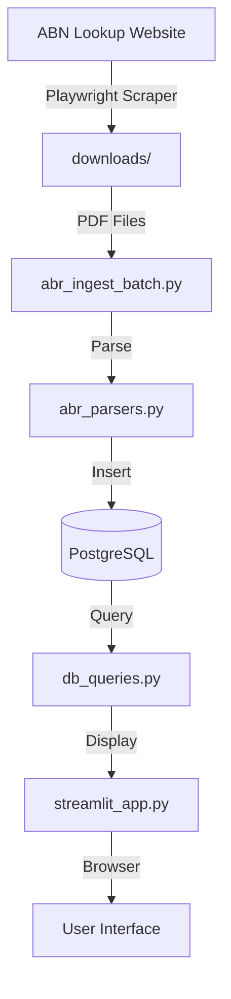
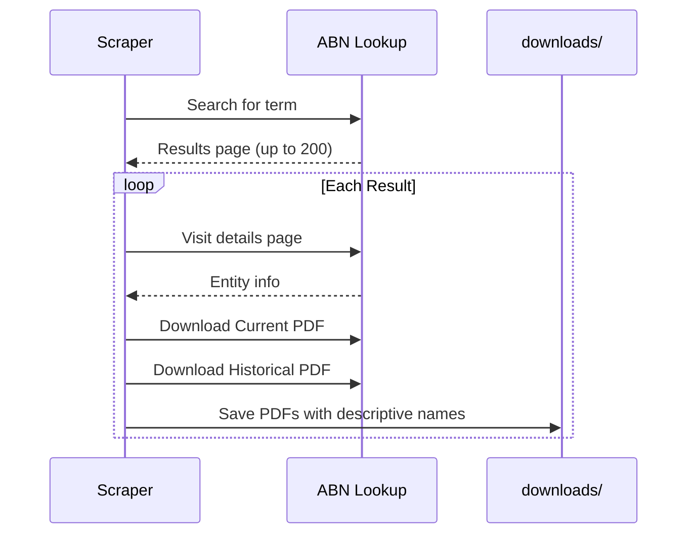
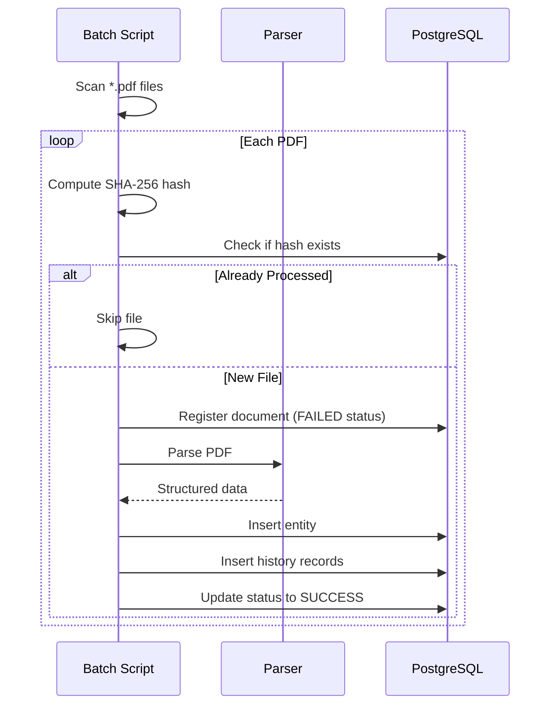
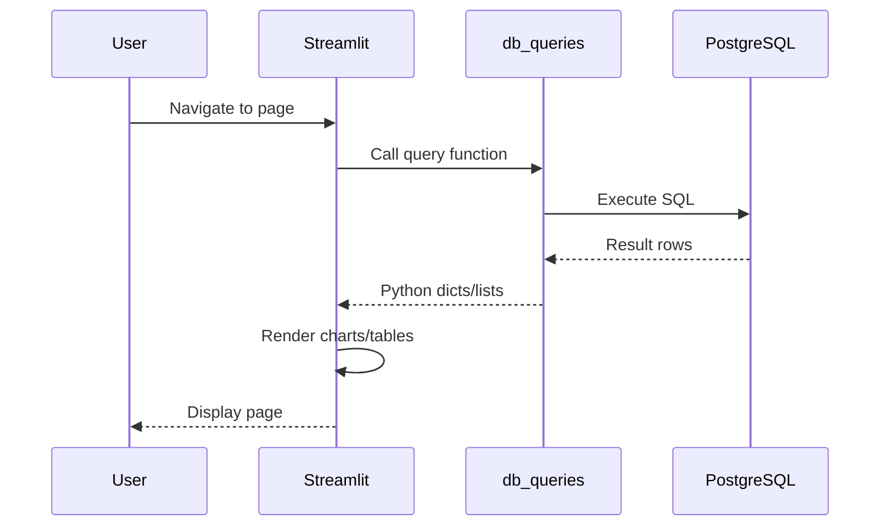
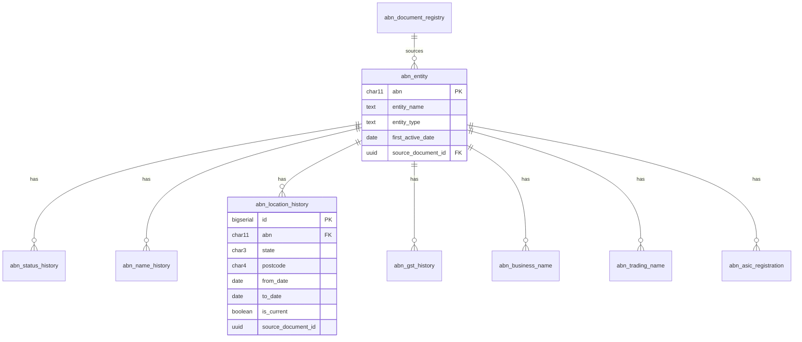

# ABN Scraper & Browser System Documentation

> Comprehensive documentation for agent handoff and project continuity

---

## Table of Contents

1. [Project Overview](#project-overview)
2. [System Architecture](#system-architecture)
3. [Component Inventory](#component-inventory)
4. [Data Flow](#data-flow)
5. [Database Schema](#database-schema)
6. [Key Workflows](#key-workflows)
7. [Streamlit UI](#streamlit-ui)
8. [Running the System](#running-the-system)
9. [Known Limitations](#known-limitations)
10. [Future Enhancements](#future-enhancements)

---

## Project Overview

### Purpose

This system scrapes, ingests, and visualizes Australian Business Register (ABR) data from ABN Lookup PDFs. It supports longitudinal analysis of:

- Entity status changes over time
- Business location movements (state/postcode)
- Trading name and business name reuse patterns
- GST registration history

### Design Principles (KISS)

- **Insert-only**: No updates or deletes to data
- **ABR-only**: No external data enrichment
- **Document-level idempotency**: Each PDF processed exactly once (SHA-256 hash)
- **Exact fidelity**: Dates reflect ABR statements exactly
- **Auditability**: Every row traceable to source document

---

## System Architecture



### Components Overview

| Layer | Component | Purpose |
|-------|-----------|---------|
| **Scraping** | `abn_pdf_scraper.py` | Downloads PDFs from ABN Lookup |
| **Ingestion** | `abr_ingest_batch.py` | Orchestrates batch PDF processing |
| **Parsing** | `abr_parsers.py` | Extracts structured data from PDFs |
| **Database** | `abr_db_manager.py` | Database operations & schema init |
| **Queries** | `db_queries.py` | Query functions for UI |
| **UI** | `streamlit_app.py` | Web-based browser interface |

---

## Component Inventory

### Core Python Modules

#### `abn_pdf_scraper.py`

- **Purpose**: Playwright-based scraper for ABN Lookup website
- **Input**: Search term (e.g., company name)
- **Output**: PDF files in `downloads/` directory
- **Key Features**:
  - Pagination (up to 200 results)
  - Downloads Current + Historical details PDFs
  - Collects ASIC registration links
  - Descriptive filenames with entity name

#### `abr_ingest_batch.py`

- **Purpose**: Batch ingestion orchestrator
- **Entry Point**: `python abr_ingest_batch.py --dir downloads`
- **Workflow**:
  1. Scan directory for `ABN*.pdf` files
  2. Compute SHA-256 hash for idempotency
  3. Skip already-processed documents
  4. Parse PDF via `ABRPDFParser`
  5. Insert data to PostgreSQL
  6. Log success/failure per file

#### `abr_parsers.py`

- **Purpose**: PDF text extraction and parsing
- **Classes**: `ABRPDFParser`
- **Document Types**:
  - `CURRENT` - Current details PDFs
  - `HISTORICAL` - Historical details PDFs
- **Key Methods**:
  - `_parse_current()`: Extracts current entity state
  - `_parse_historical()`: Extracts full history (name, status, location, GST, trading names)

**Important**: Historical PDFs use section headers like "Entity name From To" (not "Entity name history"). The parser handles this format.

#### `abr_db_manager.py`

- **Purpose**: Database connection and operations
- **Key Methods**:
  - `initialize_schema()`: Creates tables from SQL file
  - `register_document()`: Registers new PDF for processing
  - `upsert_entity()`: Insert/update entity record
  - `insert_history_records()`: Bulk insert history rows

#### `db_queries.py`

- **Purpose**: Query functions for Streamlit UI
- **Key Functions**:
  - `get_dashboard_stats()`: High-level entity statistics
  - `get_entity_detail(abn)`: Full entity profile with all history
  - `get_analytics_data_filtered()`: Filtered analytics with state/postcode/entity type
  - `get_map_data()`: Entity data for geographic visualization
  - `get_postcodes_by_state()`: Dependent postcode filtering

#### `streamlit_app.py`

- **Purpose**: Web UI for browsing and analyzing data
- **Pages**:
  - Dashboard: Overview metrics
  - Search: Entity search with filters
  - Entity Detail: Full entity profile
  - Analytics: Charts and filtered analysis
  - Map View: Geographic visualization

### Configuration Files

| File | Purpose |
|------|---------|
| `01_schema_postgres_abr.sql` | PostgreSQL schema definition |
| `docker.yaml` | Docker Compose for scraper service |
| `Dockerfile` | Container with Playwright |
| `requirements.txt` | Python dependencies |

### Documentation Files

| File | Purpose |
|------|---------|
| `README_ABR_Ingestion_Submodule.md` | Ingestion subsystem documentation |
| `ARCHITECTURAL_NOTES.md` | Scraper architecture notes |
| `03_parser_rules_abr.md` | PDF parsing rules |
| `05_sql_analysis_query_pack.sql` | Analysis SQL queries |

---

## Data Flow

### 1. Scraping Flow



### 2. Ingestion Flow



### 3. Query Flow (UI)



---

## Database Schema

### Entity Relationship Diagram



### Tables Summary

| Table | Purpose | Key Fields |
|-------|---------|------------|
| `abn_entity` | Core entity record | abn, entity_name, entity_type |
| `abn_document_registry` | PDF tracking | file_hash, ingestion_status |
| `abn_status_history` | ABN status over time | status, from_date, to_date |
| `abn_name_history` | Entity name changes | entity_name, from_date, to_date |
| `abn_location_history` | Business location changes | state, postcode, from_date, to_date |
| `abn_gst_history` | GST registration history | gst_status, from_date, to_date |
| `abn_business_name` | Registered business names | business_name, from_date |
| `abn_trading_name` | Trading names | trading_name, from_date |
| `abn_asic_registration` | ASIC company numbers | asic_number, asic_type |

---

## Key Workflows

### Workflow 1: Full Data Refresh

```bash
# 1. Run scraper for search terms
python abn_pdf_scraper.py --search "Company Name"

# 2. Clear existing data (optional)
psql -c "DELETE FROM abn_document_registry; DELETE FROM abn_entity CASCADE;"

# 3. Re-ingest all PDFs
python abr_ingest_batch.py --dir downloads

# 4. Verify
python verify_queries.py
```

### Workflow 2: Incremental Ingestion

```bash
# Add new PDFs to downloads/
# Run ingestion (existing hashes skipped automatically)
python abr_ingest_batch.py --dir downloads
```

### Workflow 3: Schema Reset

```bash
# Initialize schema from SQL file
python abr_ingest_batch.py --dir downloads --init
```

---

## Streamlit UI

### Pages

| Page | Features |
|------|----------|
| **Dashboard** | High-level entity type distribution (5 categories), state distribution, GST summary |
| **Search** | Text search, entity type filter, state filter, pagination |
| **Entity Detail** | Full profile with all history tables |
| **Analytics** | State-constrained postcode filter, context-sensitive distribution chart, entity type toggle |
| **Map View** | Postcode-level geographic visualization, filtered entity table |

### Key UI Features

- **State-constrained postcode filter**: When state selected, postcode dropdown shows only that state's postcodes
- **Context-sensitive chart**: Shows State distribution by default; switches to Postcode distribution when state selected
- **High-level entity categories**: Individual/Sole Trader, Partnership, Trust, Company, Superannuation Fund

### Running the UI

```bash
# Default port
streamlit run streamlit_app.py

# Custom port
streamlit run streamlit_app.py --server.port 8506
```

---

## Running the System

### Prerequisites

- Python 3.9+
- PostgreSQL (localhost:5432, database: postgres, user: postgres, password: password)
- Required packages: `pip install -r requirements.txt`

### Environment Variables

```bash
PGHOST=localhost
PGPORT=5432
PGDATABASE=postgres
PGUSER=postgres
PGPASSWORD=password
```

### Quick Start

```bash
# 1. Initialize database
python abr_ingest_batch.py --dir downloads --init

# 2. Start Streamlit
streamlit run streamlit_app.py
```

---

## Known Limitations

1. **No duplicate detection across PDFs**: If same ABN appears in multiple PDFs, history records may duplicate
2. **Postcode geocoding**: Map uses approximate state centroids + offset, not actual postcode coordinates
3. **PDF format dependency**: Parser assumes specific ABR PDF layout; format changes require parser updates
4. **No real-time updates**: Batch processing only, no live ABN Lookup integration

---

## Future Enhancements

> Items documented for future development (KISS - not critical)

### High Priority

- [ ] **Deduplication**: Handle duplicate history records from multiple PDF sources
- [ ] **Incremental UI refresh**: Show ingestion progress in UI

### Medium Priority

- [ ] **Postcode boundary choropleth**: Download Australian postcode GeoJSON from ABS for proper geographic visualization
- [ ] **ASIC link integration**: Parse and store ASIC registration details from collected links

### Low Priority

- [ ] **Proxy rotation**: For larger batch scraping (>200 results)
- [ ] **Cloud storage**: S3/GCS integration for PDF storage
- [ ] **Resume logic**: SQLite tracking for scraper state

---

## Contact & Handoff Notes

This documentation created: 2026-01-06

**Key files to review when resuming work:**

1. `abr_parsers.py` - PDF parsing logic (recently fixed for Historical PDFs)
2. `db_queries.py` - Query functions with high-level category mapping
3. `streamlit_app.py` - UI pages and filter logic

**Recent changes:**

- Fixed Historical PDF parser to correctly extract location/status/name/GST history
- Added state-constrained postcode filters to Analytics and Map pages
- Removed gradient styling for solid blue headers
